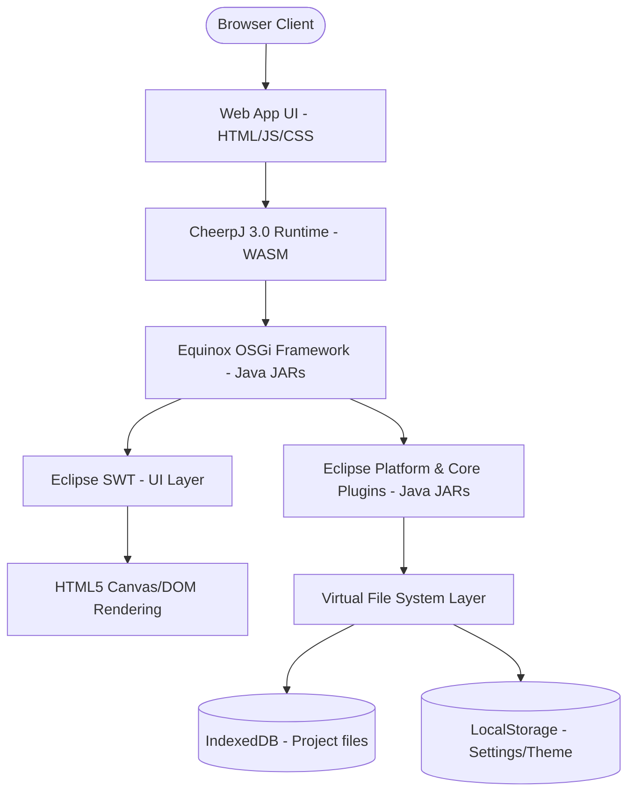

# Implementation Plan - Eclipse IDE WASM Web Application Porting

This plan details the step-by-step roadmap to port the Eclipse IDE codebase into a client-side web application running via WebAssembly (WASM) and persisting its state using IndexedDB, LocalStorage, and browser APIs.

---

## Technical Feasibility & Architecture

To run a complex Java/SWT application like Eclipse in a web browser without a backend server, we will use **CheerpJ 3.0** (a JVM-in-WASM compiler and runtime). 

### Key Technologies:
1. **Runtime:** CheerpJ 3.0 (translates Java bytecode on-the-fly to JS/WASM).
2. **File System (VFS):** `/str/` virtual mount pointing to IndexedDB (keeps the workspace files persistent across page reloads).
3. **UI Display:** CheerpJ's built-in AWT/GTK-to-HTML5 canvas rendering.
4. **Project Host:** A modern frontend framework (React + Vite) in a subdirectory `./eclipse-web-app`.

---

## Step-by-Step Roadmap

### Phase 1: Local Java Build
We must first compile the Eclipse Java projects into standard `.jar` files using Maven on the host system.
- Build command: `mvn clean install -DskipTests=true` within the active aggregator and platform directories.

### Phase 2: Set Up Web Application Directory
We will initialize a clean, modern frontend application (`./eclipse-web-app`) to host the WASM player and storage logic.
- Technology: React + Vite + Vanilla CSS.
- [NEW] Initialize `./eclipse-web-app` using Vite.

### Phase 3: Implement CheerpJ 3.0 & VFS Integration
We will configure CheerpJ to load the compiled Eclipse JARs and initialize the virtual filesystem.
- Write the initialization script mapping the virtual `/files` path to IndexedDB.
- Set up LocalStorage synchronization for user preferences.

### Phase 4: Running and Debugging UI Rendering
- Launch the development server.
- Troubleshoot SWT UI canvas rendering and thread synchronization.

---

## Open Questions

> [!IMPORTANT]
> 1. **이클립스 핵심 기능 중 어디까지 웹앱에서 실행할 것인가요?**
>    - 전체 Java IDE(컴파일러, 리팩토링 툴 등 포함)를 다 띄울 것인지, 혹은 텍스트 에디터와 기본적인 파일 구조 탐색 기능(Lightweight IDE)부터 점진적으로 활성화할 것인지 결정이 필요합니다. (초기에는 Core Platform UI와 기본 에디터 활성화를 추천합니다.)
>
> 2. **빌드를 위한 JDK/Maven 버전 정보가 시스템 환경과 일치하는가요?**
>    - 현재 로컬 장비에 설치된 Java 버전이 17 이상인지 확인이 필요합니다.

---

## Verification Plan

### Automated/Build Verification
- Verify that `mvn clean verify -DskipTests=true` completes successfully in `eclipse.platform.releng.aggregator`.

### Manual Verification
- Deploy the frontend development server and open the web browser.
- Verify that IndexedDB gets initialized with the virtual workspace directory.
- Verify that workspace file changes survive page refreshes.
